<h3><code>EthanSharma-Wadeson@github ~ $ whoami</code></h3>

<table>
<tr>
<td valign="top" width="370"></td>
<td valign="top" width="490"></td>
</tr>
</table>

**Ethan SW · Ethan Sharma-Wadeson**

Hey, I'm Ethan 👋

I'm interested in understanding how things work — from financial markets and language models to physical systems and software itself.

### What I'm building

**Financial SaaS**  
Building **NVE**, a financial SaaS project focused on using NLP and semantic analysis to understand narrative instability and information around markets.

**AI / ML**  
Exploring machine learning from the ground up, with a particular interest in NLP, agents, neural networks and systems that can learn from real-world information rather than simply following predefined rules.

**Physics & Simulation**  
Building physics simulations from scratch to understand how mathematical models translate into actual computational systems — and experimenting with using ML to learn and predict physical behaviour.

**Polymathic learning**  
I'm not particularly interested in staying inside one field. I like connecting ideas from computer science, mathematics, physics, finance and AI, and seeing what happens when they overlap.

### Current interests

- Financial technology & quantitative ideas
- NLP and semantic analysis
- Machine learning
- AI agents and emergent behaviour
- Physics simulation
- Computational modelling
- Algorithms & computer science
- Building unusual projects from scratch

### Philosophy

I prefer building things I don't completely understand yet.

The goal isn't just to learn another framework or make another basic project — it's to understand the underlying ideas well enough to build something myself.

<h3><code>EthanSharma-Wadeson@github ~ $ ./stack.sh</code></h3>

 

<h3><code>EthanSharma-Wadeson@github ~ $ ./contributions.sh</code></h3>

 

<h3><code>EthanSharma-Wadeson@github ~ $ ./links.sh</code></h3>

